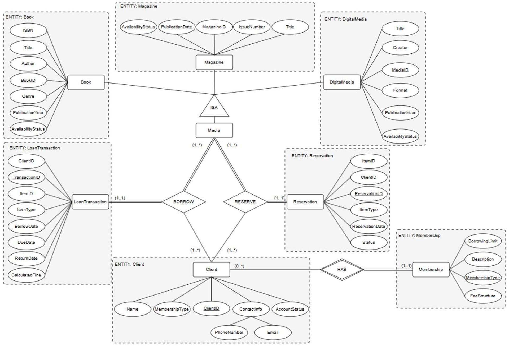
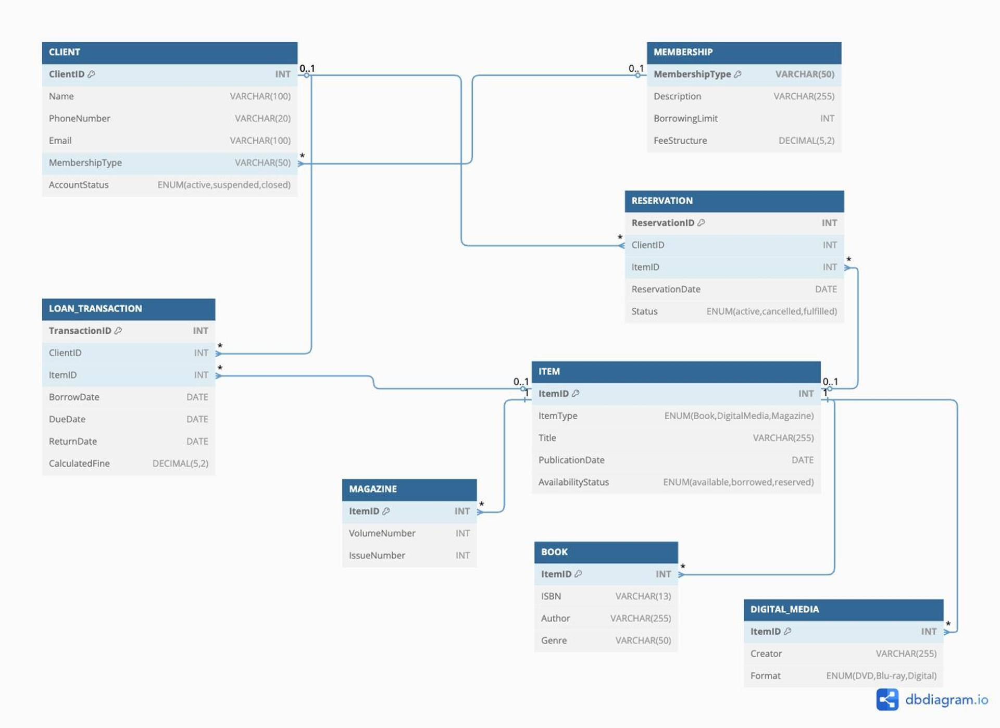

<h1 align="center">Libarary Management System</h1>
<h6 align="center"><i>A user-friendly library database solution</i></h6>

Our Library Management System is an **essential** tool for any small to midsize libary to manage its personnel, clients, and resources in an efficient manner. Using a relational model, we provide an elegant interface for library clients and staff to perform their respective needs from browsing the catalog and reserving items to processing checkouts and managing client memberships. The system provides extensive feedback and reports on borrowing trends, client activity, financial management to help your guide future plans and decisions. The system is reliable and dependable as your library grows and you seek to fulfill the aim of **every** client.

The LMS scope includes:

- Management of various library resources from books, digital media, and magazines
- Extensive data on each item to guide clients
- Membership and client management
- Transacation recording for all borrows and returns
- Constraints on borrowing and overdue limits
- Easy to use staff and client interfaces
- Feedback and notification generation for staff and clients
- Built with MariaDB and accessibly both locally and remotely

## CCADM Team

- Carson Abbott
  - Team Admin and Project Manager
  - Oversees project management, organizes meetings, and serves as primary contact
  - carson.abbot@ku.edu
- Darshil Patel
  - Developer
  - Developing DBMS and model design
  - pateldarshil02@ku.edu
- Chase Curtis
  - UI/UX Designer & Front-End Developer
  - Designing user interface, ensuring usability, accessibility, and clear documentation
  - curtischase6@ku.edu
- Aryan Kevat
  - Developer
  - Development of library database, code and pull request review, maintaining meeting logs
  - aryankevat@ku.edu
- Matthew Petillo
  - Developer
  - Development of database, verfication and quality assurance, documenting team meetings
  - mpetillo@ku.edu

## Relational Model

|  |  |
| --------------------------- | ------------------------ |

## Documents

[Project Vision](https://github.com/carson26/DBProject/blob/main/documents/%5BEECS%20447%5D%20Project%20Part%201%20Vision%20and%20Plan.pdf)

[Database Requirements](https://github.com/carson26/DBProject/blob/main/documents/%5BEECS%20447%5D%20Project%20Part%202%20Database%20Requirements.pdf)

[Conceptual Model](https://github.com/carson26/DBProject/blob/main/documents/%5BEECS%20447%5D%20Project%20Part%203%20Conceptual%20Model.pdf)

[Logical Model](https://github.com/carson26/DBProject/blob/main/documents/%5BEECS%20447%5D%20Project%20Part%204%20Logical%20Model.pdf)
